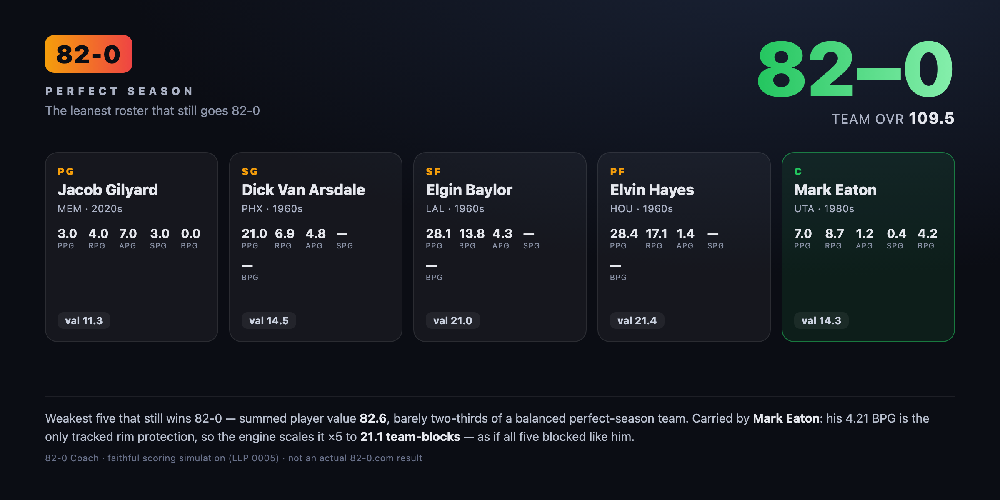

# LLP 0005: Scoring-System Edges

**Type:** Research
**Status:** Active
**Systems:** Scoring, Strategy, Game-Data
**Author:** Charlie Cheever / Claude
**Date:** 2026-06-06
**Related:** [LLP 0001](./0001-82-0-team-strategy.spec.md) (the scoring engine — authoritative), [LLP 0003](./0003-how-to-go-82-0.guide.md), [LLP 0004](./0004-82-0-team-candidates.reference.md)

## Summary

Findings from pushing the live Standard scoring engine to its limits — reproducible with `scripts/best-team.mjs` and `scripts/worst-team.mjs`:

1. **The best possible legal team scores teamOVR 139.4** — four 1960s scoring monsters plus Michael Jordan.
2. **You'd play it ~1.6 billion times to draw that exact team** — it's a curiosity, not a goal.
3. **It's 27% higher-rated than a bare-minimum 82-0 team, and the game does not care** — wins cap at 82 long before 139.4, so both go 82-0.
4. **The weakest possible 82-0 team carries ~46% less raw talent** than the ceiling team (summed `val` ~83 vs 120.6) — by abusing one quirk: a single shot-blocker's defense, counted ×5, plus four cheap scorers.

Underlying the last two is the one finding that actually matters for play — a quirk of the scoring formula that means **a player's value depends on their teammates**: a *better* player (higher `val`) can make a team *worse*. The Oscar Robertson vs. Russell Westbrook case below is the clean example, and the floor team is the quirk pushed to its limit.

## The ceiling team

Maximizing teamOVR over all legal 5-man lineups (one per slot, distinct names, eligibility respected; searched on real teamOVR, not a val-sum, and stable from top-40 to top-70 candidates per position):

| Slot | Player | Team · Era | `val` |
|---|---|---|---:|
| PG | Oscar Robertson | SAC · 1960s | 22.2 |
| SG | Michael Jordan | CHI · 1980s | 23.5 |
| SF | Elgin Baylor | LAL · 1960s | 21.0 |
| PF | Bob Pettit | ATL · 1960s | 22.0 |
| C | Wilt Chamberlain | GSW · 1960s | 32.0 |

**teamOVR 139.4 → projected 82-0.** Note it tops the plain sum of the five vals (120.6) by ~19 points — that gap is the steals/blocks quirk below.

Two structural reasons this lineup is four-fifths 1960s:

- **The formula rewards raw box-score volume and has no three-point term.** Weights are PPG 0.46 / RPG 0.25 / APG 0.18 / SPG 0.07 / BPG 0.04 ([LLP 0001](./0001-82-0-team-strategy.spec.md#team-ovr)). The 1960s posted absurd per-game lines (Wilt's 50/25 season, Oscar near a nightly triple-double), so they dominate a volume-weighted, no-three-point score.
- **The steals/blocks amplification quirk** (next section) actively *prefers* players with no tracked defense, which the pre-1974 era supplies in bulk.

## The steals/blocks quirk: value is contextual

Points, rebounds, and assists are summed across the five players. **Steals and blocks are not** — the live engine averages them over *only the players who have a positive tracked value*, then scales that average back up to a five-man line ([LLP 0001](./0001-82-0-team-strategy.spec.md#the-scoring-engine-live-standard-mode)):

```
adjSpg = sum(spg where spg > 0) * 5 / count(spg > 0)
adjBpg = sum(bpg where bpg > 0) * 5 / count(bpg > 0)
```

This was designed so pre-1974 players (no tracked steals/blocks) don't drag a team down. But it has a side effect: **if only one player on your team has tracked defense, that one player's steals and blocks are scaled ×5 — counted as if all five players defended like him.** Add a second tracked defender and you start *averaging*, which can pull the number down.

### Worked example — is Oscar Robertson better than Russell Westbrook at PG?

By individual `val`, **no**: Westbrook's 2020s season (**24.2**) outscores Robertson's 1960s season (**22.2**) by 2.0. Russ is the more valuable player in the game's own currency.

On the ceiling team, **Oscar is better — by 6.5 teamOVR points** — and the reason is entirely the quirk:

| | Oscar at PG (optimal) | Russ swapped in at PG |
|---|---|---|
| Players with tracked steals/blocks | Jordan only | Jordan **and** Westbrook |
| `adjSpg` | 2.81 × 5 = **14.05** | (2.81 + 1.4)/2 × 5 = **10.53** |
| `adjBpg` | 1.18 × 5 = **5.90** | (1.18 + 0.4)/2 × 5 = **3.95** |
| **teamOVR** | **139.4** | **132.9** |

Oscar Robertson has *no* tracked steals or blocks, so on this team Jordan stays the lone defender and his elite 2.81 SPG / 1.18 BPG get amplified ×5. Swap in Westbrook and you add a second, weaker-defending tracked player; the team's effective steals fall from 14.05 to 10.53 and blocks from 5.90 to 3.95. That defensive loss (~6.5 OVR) dwarfs Russ's +2.0 scoring edge.

So **"better player" and "better for this team" come apart.** Oscar wins here not despite having no steals/blocks but *because* of it: on a team whose defense is carried by one amplified stopper, a pure-volume teammate preserves the amplification, while a second mediocre defender dilutes it. On a different team — say five modern players who all have tracked defense — the averaging is benign and Russ's higher `val` would win. **A player's worth is contextual; rank final candidates by marginal teamOVR, not raw `val`** (which is exactly what the policy does — [LLP 0001](./0001-82-0-team-strategy.spec.md#the-currency-player-value-val)).

## The floor team

The opposite extreme: the *weakest* roster that still goes 82-0. Every 82-0 team ties at teamOVR 109.5, so "weakest" can't mean lowest-rated — it means **least raw talent**: minimize the five players' summed `val` subject to teamOVR ≥ 109.5. The search (`scripts/worst-team.mjs`) lands here:

| Slot | Player | Team · Era | `val` | BPG |
|---|---|---|---:|---:|
| PG | Jacob Gilyard | MEM · 2020s | 11.3 | — |
| SG | Dick Van Arsdale | PHX · 1960s | 14.5 | — |
| SF | Elgin Baylor | LAL · 1960s | 21.0 | — |
| PF | Elvin Hayes | HOU · 1960s | 21.4 | — |
| C | **Mark Eaton** | UTA · 1980s | 14.3 | **4.21** |

**teamOVR 109.5 → 82-0, with a summed `val` of just 82.6** — against ~108 for a balanced team and 120.6 for the ceiling team. It's the quirk run to its limit: Mark Eaton, a defensive specialist who barely scored (7 PPG), is the only real shot-blocker, so his 4.21 BPG is "averaged" over one player and scaled ×5 to **21.05 team-blocks** — roughly **26 of the 109.5 OVR points come from Eaton's blocks alone**, as if all five protected the rim like prime Eaton. Four cheap scorers supply just enough points, rebounds, and assists around him.

Two honest caveats:

- **The PG slot games a data artifact.** Jacob Gilyard's line (3 PPG / 3 SPG, all integers) is a tiny-sample season, and the engine/dataset apply **no minutes or games-played weighting** — so a noisy 3.0-steals rate is amplified ×5 exactly like a real one. That's a finding in its own right: the score is exploitable by small-sample outliers. Swap him for a legitimate full-season player and a blocks-anchored team still lands in the low-to-mid 80s (e.g. built around Hakeem Olajuwon's 3.46 BPG → summed `val` ~84).
- **It is not unique.** Many rosters tie near this floor; local search returns one. The stable, structural point is the headline: *one amplified rim protector can carry an entire 82-0 defense.*

**The bookend:** the ceiling team carries ~46% more raw player value than the floor team (summed `val` 120.6 vs 82.6), and the scoreboard shows both an identical 82-0. Everything above teamOVR 110 is invisible to the game — and so is the gulf between a stacked roster and four bargains propping up one shot-blocker.



*Faithful render of this roster's result card, scored by the real engine — not an actual 82-0.com result. Regenerate with `node scripts/render-team-card.mjs`, then screenshot `dist/team-card.html`.*

## The win cap: greatness the game never pays for

A bare-minimum 82-0 team just clears the rounding threshold of **teamOVR 109.5**. The ceiling team is **+29.9 OVR higher (~27%)**. But the win curve `wins = round(82 · min(teamOVR/110, 1)^1.15)` **caps at 82 wins once teamOVR reaches 110** ([LLP 0001](./0001-82-0-team-strategy.spec.md#win-curve)). The ceiling team sits **29.4 points above that cap**.

So both teams project to an identical **82-0**. By the rating, the dream team is 27% better; by the only outcome the game awards, it's the same perfect season. **Past teamOVR 109.5, more rating buys you nothing** — which is the whole reason the strategy ([LLP 0003](./0003-how-to-go-82-0.guide.md)) chases *exactly* 109.5 and not a point more.

## Draw rarity: ~1.6 billion games

The five players sit in five distinct (team, era) pools (SAC·1960s, CHI·1980s, LAL·1960s, ATL·1960s, GSW·1960s). Treating each spin as a uniform draw over the **180 populated pools**, a single game yields this exact team only if all five needed pools come up across the five rounds:

$$P = \frac{5!}{180^5} \approx 6.4 \times 10^{-10} \quad\Rightarrow\quad \approx 1.57\text{ billion games}$$

At ~5 seconds per attempt (most end on the first wrong spin) that's roughly **250 years of nonstop play**. Skips don't help: a Team or Era skip only swaps the team *or* the decade, so it can't jump to an arbitrary specific pool — chasing one exact roster, you just restart. *(Caveat: the live draw distribution isn't documented; if it isn't uniform the figure shifts, but you still need five rare specific pools, so it stays on the order of 10⁹.)*

## What this means for the extension

- **The Coach is right to target 109.5, not the ceiling.** The win cap makes everything above 110 worthless, and the ceiling team is unreachable in practice. No change to the policy.
- **The quirk is faithful, not a bug.** `src/lib/engine.js` already implements the positive-only steals/blocks averaging, annotated to [LLP 0001](./0001-82-0-team-strategy.spec.md#the-scoring-engine-live-standard-mode). This document is the "why it matters" companion.
- **Rank by marginal teamOVR, never raw `val`.** The Oscar/Russ case is the standing reminder: `val` is a display and threshold unit; the actual take decision must use marginal teamOVR against the current roster, because steals/blocks don't add linearly.
- **The dataset has no sample-size guard.** There's no games-played field, so outlier seasons can be gamed (the floor team's PG). Harmless for the advisory product, which scores the live on-card stats — but worth knowing if a future feature ever ranks bundled seasons directly.
- **If a future mode ever optimizes teamOVR itself** (e.g. a "max rating" challenge rather than 82-0), the quirk and the cap are first-order — write a decision LLP before building it.

## Reproduce

```sh
node scripts/best-team.mjs  [K]                  # ceiling team (default K=40 candidates/position)
node scripts/worst-team.mjs [restarts] [seed]    # floor team   (default 1200 restarts, seed 1)
```

`best-team.mjs` prints the ceiling team, the steals/blocks breakdown, the draw-rarity math, and the comparison to a minimum 82-0 team. `worst-team.mjs` prints the floor team and the amplified-defense breakdown.
